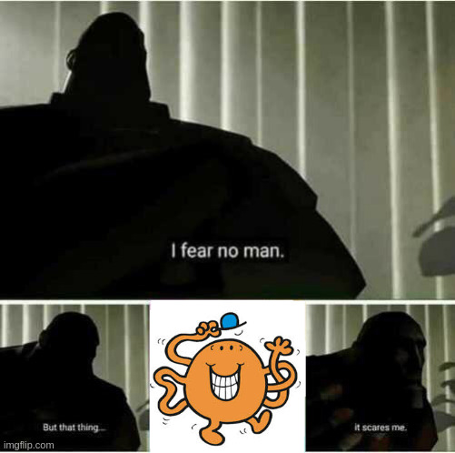

# FCSC 2025 Chatouille

Auteur : Cryptanalyse

Origine : [Chatouille](https://hackropole.fr/fr/challenges/reverse/fcsc2025-reverse-chatouille/)

## Challenge
[files/chatouille](files/chatouille)

-----------

## Installation manuel
Vous n'utilisez pas l'application **les CTFs de Cyrhades** ? C'est dommage !
Mais voici comment installer ce CTF manuellement :

> git clone https://github.com/Hack-Oeil/fcsc2025-reverse-chatouille.git

> cd fcsc2025-reverse-chatouille

> docker compose up

-----------

## Sur le site officiel hackropole.fr
> https://hackropole.fr/fr/challenges/reverse/fcsc2025-reverse-chatouille/
